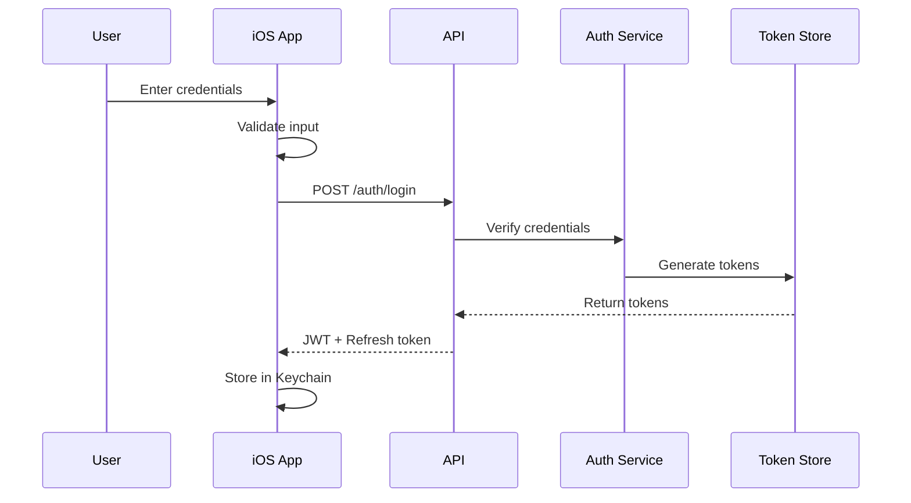

# Security Architecture Document
## Mobile Terminal Access for Code-Server

### Executive Summary

This document outlines the comprehensive security architecture for the Mobile Terminal Access system, consisting of a VS Code extension and iOS mobile application. The architecture follows defense-in-depth principles, implementing multiple layers of security to protect terminal access, user credentials, and system integrity.

### Security Principles

1. **Principle of Least Privilege**: Users and processes have minimum necessary permissions
2. **Defense in Depth**: Multiple security layers to prevent single point of failure
3. **Zero Trust**: Never trust, always verify - all requests are authenticated and authorized
4. **Data Protection**: Encryption at rest and in transit for all sensitive data
5. **Audit and Monitoring**: Comprehensive logging of security-relevant events

### Threat Model

#### Assets to Protect
1. Terminal access and command execution capabilities
2. User credentials and authentication tokens
3. Terminal output and command history
4. VS Code/code-server system integrity
5. Network communications
6. Custom command configurations

#### Threat Actors
1. **External Attackers**: Attempting unauthorized access via network
2. **Malicious Apps**: Other apps on user's device attempting data theft
3. **Network Attackers**: Man-in-the-middle attacks on communications
4. **Insider Threats**: Authorized users exceeding permissions
5. **Physical Access**: Device theft or unauthorized physical access

#### Attack Vectors
1. Credential theft or brute force attacks
2. Token hijacking or replay attacks
3. Command injection vulnerabilities
4. WebSocket hijacking
5. API exploitation
6. Device compromise
7. Network eavesdropping

### Security Architecture Layers

#### Layer 1: Network Security

##### TLS/SSL Configuration
```yaml
tls:
  version: "1.3"
  ciphers:
    - TLS_AES_256_GCM_SHA384
    - TLS_CHACHA20_POLY1305_SHA256
    - TLS_AES_128_GCM_SHA256
  certificate:
    type: "Let's Encrypt"
    renewal: "automatic"
    validation: "DNS-01"
```

##### Network Policies
- All communications over HTTPS/WSS
- Certificate pinning in iOS app
- Strict Transport Security (HSTS) headers
- No fallback to insecure protocols
- IP-based rate limiting

#### Layer 2: Authentication and Authorization

##### Authentication Flow


##### JWT Token Structure
```json
{
  "header": {
    "alg": "RS256",
    "typ": "JWT",
    "kid": "key-id-2025"
  },
  "payload": {
    "sub": "user-uuid",
    "iat": 1704625200,
    "exp": 1704711600,
    "aud": "mobile-terminal-api",
    "iss": "code-server-auth",
    "permissions": ["terminal.read", "terminal.write", "claude.execute"],
    "session": "session-uuid",
    "device": "device-fingerprint"
  }
}
```

##### Authorization Model
```typescript
interface Permission {
  resource: "terminal" | "claude" | "command";
  action: "read" | "write" | "execute" | "delete";
  scope?: string; // Optional resource-specific scope
}

interface AuthorizationPolicy {
  user: string;
  permissions: Permission[];
  constraints: {
    ipWhitelist?: string[];
    timeWindow?: { start: string; end: string };
    maxSessions?: number;
  };
}
```

#### Layer 3: Application Security

##### VS Code Extension Security

1. **Input Validation**
```typescript
class CommandValidator {
  private readonly blacklistPatterns = [
    /rm\s+-rf\s+\//,  // Prevent dangerous commands
    /:(){ :|:& };:/,  // Fork bomb
    />\/dev\/sda/,     // Direct disk access
  ];
  
  validate(command: string): ValidationResult {
    // Sanitize and validate all inputs
    if (this.blacklistPatterns.some(pattern => pattern.test(command))) {
      return { valid: false, reason: "Dangerous command detected" };
    }
    
    // Additional validation logic
    return { valid: true };
  }
}
```

2. **Secure Storage**
```typescript
class SecureStorage {
  private readonly context: vscode.ExtensionContext;
  
  async storeSecret(key: string, value: string): Promise<void> {
    // Use VS Code SecretStorage API
    await this.context.secrets.store(key, value);
  }
  
  async getSecret(key: string): Promise<string | undefined> {
    return await this.context.secrets.get(key);
  }
}
```

##### iOS App Security

1. **Keychain Integration**
```swift
class KeychainSecurity {
    static func saveCredentials(_ credentials: Credentials) throws {
        let encoder = JSONEncoder()
        let data = try encoder.encode(credentials)
        
        let query: [CFString: Any] = [
            kSecClass: kSecClassGenericPassword,
            kSecAttrService: "com.mobileterm.codeserver",
            kSecAttrAccount: credentials.username,
            kSecValueData: data,
            kSecAttrAccessible: kSecAttrAccessibleWhenUnlockedThisDeviceOnly,
            kSecAttrAccessControl: try createAccessControl()
        ]
        
        let status = SecItemAdd(query as CFDictionary, nil)
        guard status == errSecSuccess else {
            throw KeychainError.saveFailed
        }
    }
    
    private static func createAccessControl() throws -> SecAccessControl {
        return SecAccessControlCreateWithFlags(
            nil,
            kSecAttrAccessibleWhenUnlockedThisDeviceOnly,
            [.biometryCurrentSet, .privateKeyUsage],
            nil
        )!
    }
}
```

2. **Certificate Pinning**
```swift
class CertificatePinner: NSObject, URLSessionDelegate {
    private let pinnedCertificates: [SecCertificate]
    
    func urlSession(_ session: URLSession, 
                    didReceive challenge: URLAuthenticationChallenge,
                    completionHandler: @escaping (URLSession.AuthChallengeDisposition, URLCredential?) -> Void) {
        
        guard challenge.protectionSpace.authenticationMethod == NSURLAuthenticationMethodServerTrust,
              let serverTrust = challenge.protectionSpace.serverTrust else {
            completionHandler(.cancelAuthenticationChallenge, nil)
            return
        }
        
        // Validate against pinned certificates
        if validateServerTrust(serverTrust) {
            let credential = URLCredential(trust: serverTrust)
            completionHandler(.useCredential, credential)
        } else {
            completionHandler(.cancelAuthenticationChallenge, nil)
        }
    }
}
```

#### Layer 4: Data Protection

##### Encryption at Rest

1. **iOS Data Protection**
```swift
class DataProtection {
    static func protectFile(at url: URL) throws {
        try (url as NSURL).setResourceValue(
            URLFileProtection.completeUntilFirstUserAuthentication,
            forKey: .fileProtectionKey
        )
    }
    
    static func encryptSensitiveData(_ data: Data, key: SymmetricKey) throws -> Data {
        let sealedBox = try AES.GCM.seal(data, using: key)
        return sealedBox.combined!
    }
}
```

2. **VS Code Extension Encryption**
```typescript
class EncryptionService {
  private readonly algorithm = 'aes-256-gcm';
  
  async encrypt(data: string, key: Buffer): Promise<EncryptedData> {
    const iv = crypto.randomBytes(16);
    const cipher = crypto.createCipheriv(this.algorithm, key, iv);
    
    let encrypted = cipher.update(data, 'utf8');
    encrypted = Buffer.concat([encrypted, cipher.final()]);
    
    return {
      encrypted,
      iv,
      authTag: cipher.getAuthTag()
    };
  }
}
```

##### Encryption in Transit

- TLS 1.3 minimum for all connections
- Perfect Forward Secrecy (PFS) enabled
- Strong cipher suites only
- Certificate validation and pinning
- No compression to prevent CRIME attacks

#### Layer 5: Access Control

##### Terminal Access Control
```typescript
interface TerminalAccessControl {
  terminalId: string;
  userId: string;
  permissions: {
    read: boolean;
    write: boolean;
    delete: boolean;
  };
  restrictions: {
    allowedCommands?: string[];
    blockedCommands?: string[];
    readOnlyPaths?: string[];
    timeBasedAccess?: TimeWindow;
  };
}

class AccessControlManager {
  async checkAccess(
    user: User,
    terminal: Terminal,
    action: Action
  ): Promise<boolean> {
    const acl = await this.getACL(terminal.id, user.id);
    
    // Check basic permissions
    if (!acl.permissions[action]) {
      return false;
    }
    
    // Check additional restrictions
    return this.validateRestrictions(acl.restrictions, action);
  }
}
```

##### Command Execution Control
```typescript
class CommandExecutionGuard {
  private readonly sudoCommands = new Set(['sudo', 'su', 'doas']);
  private readonly sensitiveFiles = [
    '/etc/passwd',
    '/etc/shadow',
    '~/.ssh/id_rsa'
  ];
  
  async validateCommand(command: string, context: ExecutionContext): Promise<boolean> {
    // Check for sudo/privilege escalation
    if (this.containsSudoCommand(command)) {
      await this.auditLog('PRIVILEGE_ESCALATION_ATTEMPT', context);
      return false;
    }
    
    // Check for sensitive file access
    if (this.accessesSensitiveFiles(command)) {
      await this.auditLog('SENSITIVE_FILE_ACCESS', context);
      return false;
    }
    
    return true;
  }
}
```

### Security Monitoring and Auditing

#### Audit Logging
```typescript
interface AuditEvent {
  timestamp: Date;
  eventType: SecurityEventType;
  userId: string;
  sessionId: string;
  terminalId?: string;
  command?: string;
  ipAddress: string;
  userAgent: string;
  result: 'SUCCESS' | 'FAILURE';
  details?: Record<string, any>;
}

enum SecurityEventType {
  LOGIN_ATTEMPT = 'LOGIN_ATTEMPT',
  LOGIN_SUCCESS = 'LOGIN_SUCCESS',
  LOGIN_FAILURE = 'LOGIN_FAILURE',
  TOKEN_REFRESH = 'TOKEN_REFRESH',
  COMMAND_EXECUTION = 'COMMAND_EXECUTION',
  PRIVILEGE_ESCALATION = 'PRIVILEGE_ESCALATION',
  TERMINAL_ACCESS = 'TERMINAL_ACCESS',
  CONFIGURATION_CHANGE = 'CONFIGURATION_CHANGE',
  SECURITY_VIOLATION = 'SECURITY_VIOLATION'
}
```

#### Security Metrics
1. **Authentication Metrics**
   - Failed login attempts per user/IP
   - Token refresh patterns
   - Concurrent session counts
   - Geographic anomalies

2. **Command Execution Metrics**
   - Command frequency analysis
   - Dangerous command attempts
   - Resource usage patterns
   - Error rates

3. **System Health Metrics**
   - API response times
   - WebSocket connection stability
   - Memory/CPU usage
   - Error rates by endpoint

### Incident Response

#### Security Incident Types
1. **Critical**: System compromise, data breach
2. **High**: Repeated auth failures, privilege escalation attempts
3. **Medium**: Unusual access patterns, policy violations
4. **Low**: Configuration issues, minor policy breaches

#### Response Procedures
```yaml
incident_response:
  detection:
    - Automated monitoring alerts
    - User reports
    - System anomaly detection
  
  containment:
    - Automatic account lockout
    - IP blocking
    - Session termination
    - Service degradation
  
  investigation:
    - Log analysis
    - Forensic data collection
    - Timeline reconstruction
    - Impact assessment
  
  recovery:
    - Account restoration
    - Security patch deployment
    - Configuration updates
    - User notification
  
  post_incident:
    - Root cause analysis
    - Security improvement recommendations
    - Policy updates
    - Training requirements
```

### Security Testing

#### Penetration Testing Scope
1. **API Security**
   - Authentication bypass attempts
   - Authorization flaws
   - Injection vulnerabilities
   - Rate limiting effectiveness

2. **Mobile App Security**
   - Reverse engineering resistance
   - Local data protection
   - Certificate pinning bypass
   - Jailbreak detection

3. **Infrastructure Security**
   - Network scanning
   - Service enumeration
   - Configuration weaknesses
   - Denial of service

#### Security Testing Tools
```bash
# API Testing
- OWASP ZAP
- Burp Suite Professional
- Postman with security tests
- Custom fuzzing scripts

# Mobile Testing
- MobSF (Mobile Security Framework)
- Frida for runtime manipulation
- Charles/Proxyman for traffic analysis
- Hopper/IDA for binary analysis

# Infrastructure Testing
- Nmap for port scanning
- Metasploit for exploitation
- Nikto for web vulnerabilities
- SSL Labs for TLS configuration
```

### Compliance and Standards

#### Security Standards
1. **OWASP Mobile Top 10** - Mobile app security
2. **OWASP API Security Top 10** - API security
3. **CIS Controls** - General security controls
4. **ISO 27001** - Information security management

#### Compliance Requirements
1. **Data Protection**
   - GDPR compliance for EU users
   - CCPA compliance for California users
   - Data minimization principles
   - Right to deletion

2. **Industry Standards**
   - SOC 2 Type II controls
   - PCI DSS for payment data (if applicable)
   - HIPAA for healthcare data (if applicable)

### Security Maintenance

#### Regular Security Tasks
1. **Daily**
   - Monitor security alerts
   - Review authentication logs
   - Check system health

2. **Weekly**
   - Analyze security metrics
   - Review access patterns
   - Update security rules

3. **Monthly**
   - Security patch assessment
   - Penetration test results review
   - Security training updates

4. **Quarterly**
   - Full security audit
   - Threat model review
   - Incident response drill

### Emergency Procedures

#### Security Breach Response
```bash
#!/bin/bash
# Emergency security lockdown script

# 1. Disable all user sessions
redis-cli FLUSHDB

# 2. Rotate all secrets
./rotate-secrets.sh --emergency

# 3. Block all IPs except whitelist
iptables -A INPUT -s $ADMIN_IP -j ACCEPT
iptables -A INPUT -j DROP

# 4. Enable read-only mode
systemctl stop terminal-api
systemctl start terminal-api-readonly

# 5. Notify security team
./notify-security-team.sh --critical
```

### Security Contacts

- **Security Team Lead**: security@example.com
- **On-Call Security**: +1-XXX-XXX-XXXX
- **Bug Bounty Program**: security-bounty@example.com
- **Emergency Response**: incident-response@example.com